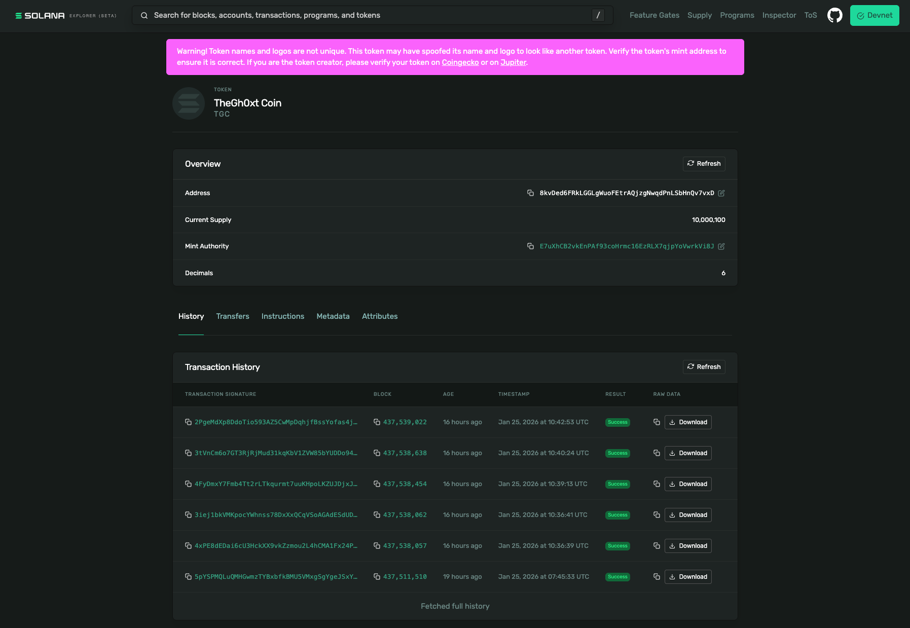
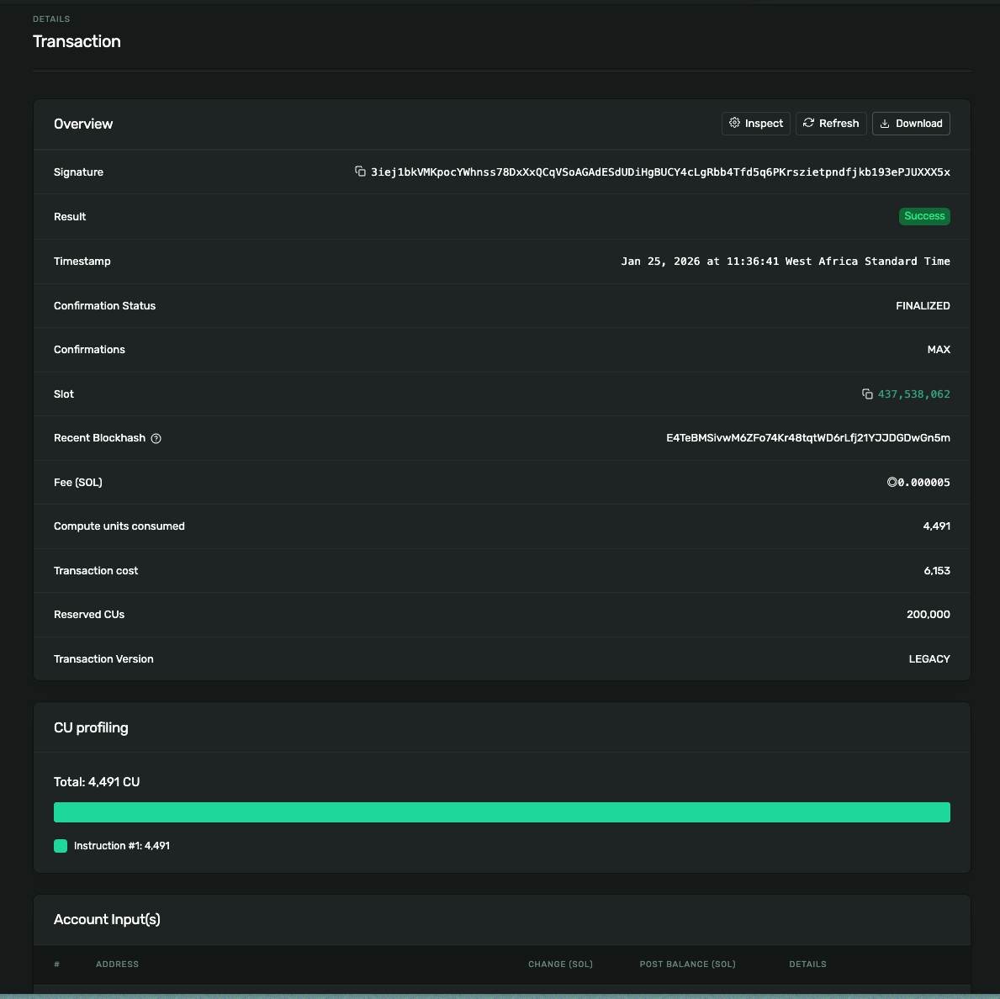
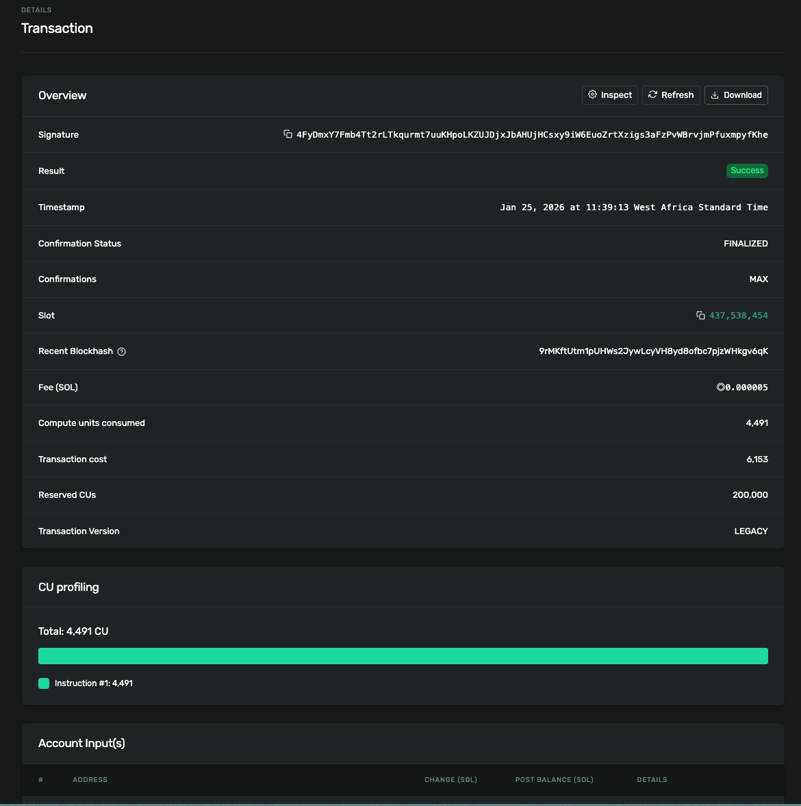
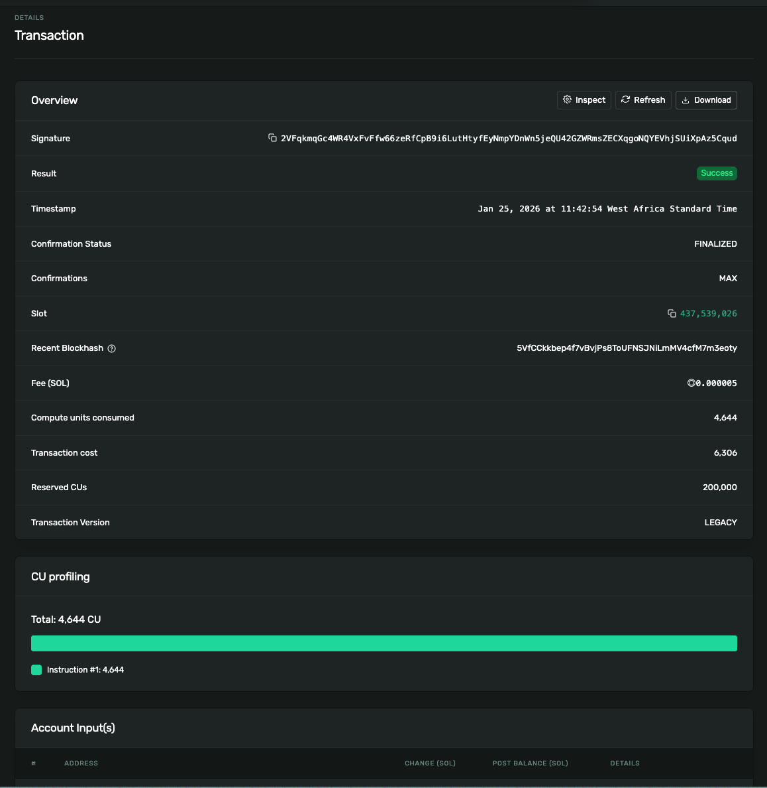

# This is my turbin3 README file for my assignment.

## turbin3-token-mint

### Token Mint Page On Solscan`
- 8kvDed6FRkLGGLgWuoFEtrAQjzgNwqdPnLSbHnQv7vxD -- token hash

### Mint TX Hash
- 3iej1bkVMKpocYWhnss78DxXxQCqVSoAGAdESdUDiHgBUCY4cLgRbb4Tfd5q6PKrszietpndfjkb193ePJUXXX5x  --- Minted 100 tokens to wallet

- 4FyDmxY7Fmb4Tt2rLTkqurmt7uuKHpoLKZUJDjxJbAHUjHCsxy9iW6EuoZrtXzigs3aFzPvWBrvjmPfuxmpyfKhe --- Minted 100,000 tokens to wallet

### Transfer TX Hash
- 2VFqkmqGc4WR4VxFvFfw66zeRfCpB9i6LutHtyfEyNmpYDnWn5jeQU42GZWRmsZECXqgoNQYEVhjSUiXpAz5Cqud --- Transferred 100 tokens to wallet

